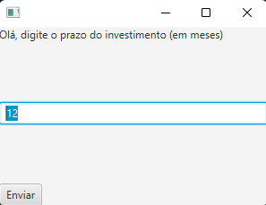
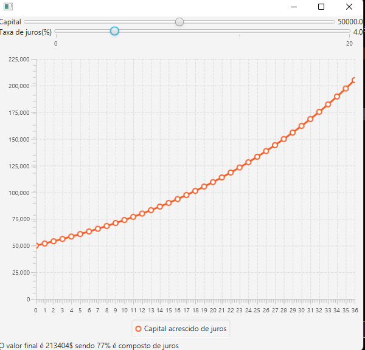

# Calculadora de juros

# How to use
Para executar esse programa foi feito pelo Intellij IDEA, é necessário que você tenha JDK 11+ e JAVAFX framework.

Caso encontre algum erro no momento de compilar é necessário que você adicione o parâmetro VM
>--module-path "path\to\javafx-sdk-18.0.2\lib" --add-modules javafx.controls,javafx.fxml

# Features

O programa é uma calculadora de juros, e aceita os seguintes parâmetros como input:
<ul>
    <li>Tempo do investimento(em meses)</li>
    <li>Capital (em $)</li>
    <li>Juros (% ao mês)</li>
</ul>

É Necessário que você insira a quantidade de meses para que o gráfico seja inicializado.

12 é o default, mas pode ser inicialiado.

A próxima tela você pode escolher o investimento de 0 a 100000$, e juros de 0 a 20%, o gráfico
se ajusta dinamicamente com os sliders.

O canto superior é apresentado o valor final do investimento detalhadamente e a composição final do juros.